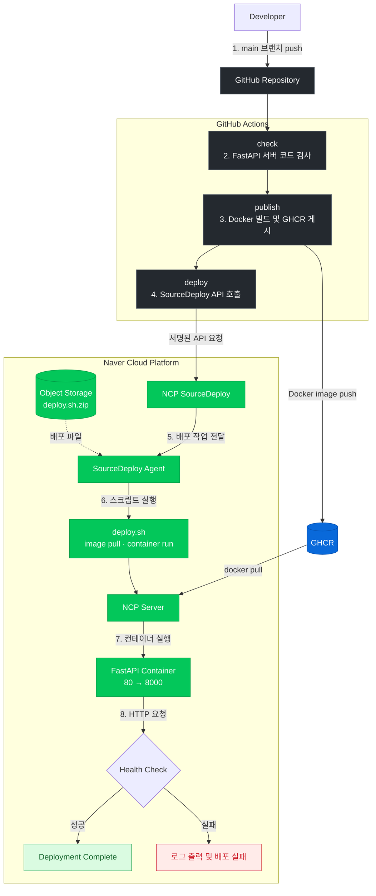
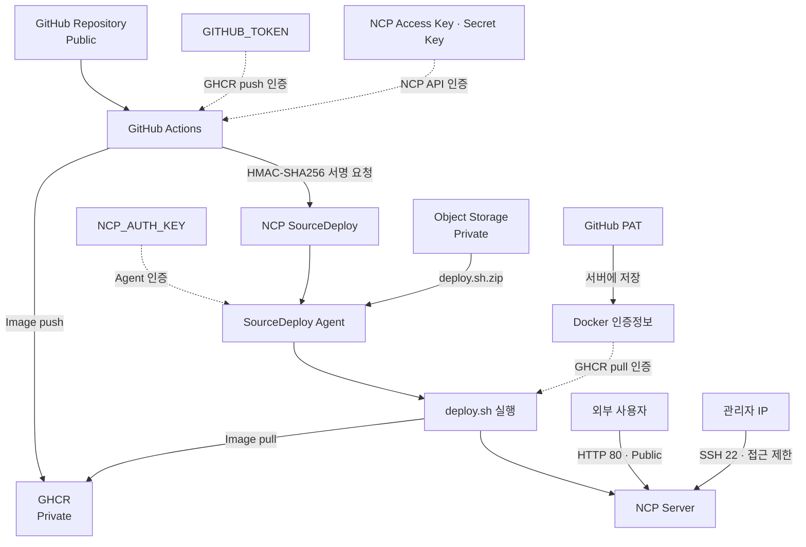

<h1 align="center">NCP CI/CD Lab</h1>

  GitHub Actions, Docker, GHCR, NCP SourceDeploy를 연동한 FastAPI 웹 API 자동 배포 프로젝트

## ncp-lab v1

**배포 주소**: `http://211.233.214.70` (현재 운영 중) 
**개발 기간**: 2026.09 ~ 진행 중 
**배포 환경**: NCP Server (Ubuntu 24.04.1 LTS)

## 목차

1. [프로젝트 개요](#프로젝트-개요)
2. [기술 스택](#기술-스택)
3. [CI/CD 아키텍처 및 배포 흐름](#cicd-아키텍처-및-배포-흐름)
4. [설계 선택과 이유](#설계-선택과-이유)
5. [보안 및 권한 관리](#보안-및-권한-관리)

## 프로젝트 개요

#### CI/CD의 전체 흐름을 이해하고 직접 구축하기 위해 시작했습니다.

프로젝트의 핵심 기능은 다음과 같습니다.

1. **서버 코드 검사**: push와 pull request마다 `main.py`의 FastAPI 서버 객체가 정상적으로 생성되는지 확인합니다.

2. **이미지 빌드 및 저장**: `main` 브랜치에 push하면 저장소의 Docker 이미지를 빌드하고 GHCR에 게시합니다.
3. **배포 요청 자동화**: GitHub Actions가 서명된 NCP API 요청으로 SourceDeploy 시나리오를 실행합니다.
4. **컨테이너 자동 교체**: SourceDeploy Agent가 `deploy.sh`를 실행해 최신 Docker 이미지를 pull하고 컨테이너를 교체합니다.
5. **배포 후 헬스 체크**: 새 컨테이너의 HTTP 응답을 최대 10회 확인하고, 실패하면 로그를 출력해 배포를 실패로 처리합니다.

## 기술 스택

### Environment

### Development

### Deployment

### Infrastructure

## CI/CD 아키텍처 및 배포 흐름

#### `check`

- Python 3.14.7과 FastAPI 서버 실행에 필요한 패키지를 설치합니다.
- `main.py`의 `app` 객체가 FastAPI 애플리케이션인지 검사합니다.
- 실패하면 이미지 게시와 배포를 진행하지 않습니다.

#### `publish`

- `check` 성공 후 `main` 브랜치 push에서만 실행합니다.
- `GITHUB_TOKEN`으로 GHCR에 로그인합니다.
- 이미지를 `ghcr.io/yoondv/ncp-lab:latest`로 게시합니다.

#### `deploy`

- GitHub Secrets에 저장된 NCP 인증 키로 HMAC-SHA256 방식의 API 요청 서명을 생성합니다.
- 프로젝트, 스테이지, 시나리오 ID를 조회한 뒤 배포 API를 호출하여 시나리오 실행을 요청합니다.
- 배포 이력 ID가 반환되지 않으면 Job을 실패로 처리합니다.

#### `deploy.sh`

- GHCR 이미지를 pull합니다.
- 기존 컨테이너를 제거하고 `80:8000`으로 새 컨테이너를 실행합니다.
- 실제 HTTP 응답을 최대 10회 확인합니다.
- 실패하면 컨테이너 로그를 출력하고 배포를 실패로 처리합니다.

## 설계 선택과 이유

### GHCR 기반 이미지 배포

소스 코드와 빌드된 Docker 이미지를 GitHub 생태계 안에서 함께 관리하기 위해 Docker Hub와 같은 별도 Registry 대신 GitHub에서 제공하는 GHCR을 선택했습니다. GitHub Actions는 기본으로 제공되는 `GITHUB_TOKEN`으로 이미지를 게시하고, NCP 서버는 GitHub PAT로 Private 이미지를 pull하도록 역할을 분리했습니다.

### SSH 대신 SourceDeploy 사용

SSH 배포를 적용하면 서버의 22번 포트에 대한 접근 범위를 넓혀야 할 수도 있습니다. 이를 피하기 위해 GitHub Actions가 NCP API로 배포를 요청하고 서버 내부의 SourceDeploy Agent가 명령을 실행하는 방식을 선택했습니다.

## 보안 및 권한 관리

### 인증 및 접근 구조

### 계정 분리

   
  GitHub Actions용 Sub Account와 SourceDeploy Agent용 Sub Account를 분리해 하나의 인증 키가 다른 배포 구성에 미치는 영향을 줄였습니다.

### 최소 권한 정책

   
  Actions용 계정에는 SourceDeploy 전체 관리 권한 대신 지정된 프로젝트의 배포 실행에 필요한 사용자 정의 정책만 적용했습니다. 
  또한 NCP 서버에서 이미지를 pull하기 위한 GitHub PAT에는 <code>read:packages</code> 권한만 부여해 토큰의 작업 범위를 이미지 읽기로 제한했습니다.

### 인증 정보 관리

   
  NCP Access Key와 Secret Key는 하드코딩하지 않고 GitHub Actions Secrets에 저장했습니다. 
  또한 NCP 서버에 저장된 인증 정보는 root 계정만 접근할 수 있도록 파일 권한을 제한했습니다.

### 네트워크 접근 제한

   
  웹 서비스용 80번 포트는 외부 접속을 허용하고, SSH 22번 포트는 관리자 공인 IP에서만 접근할 수 있도록 NCP ACG를 설정했습니다.

  <strong>감사합니다.</strong>

