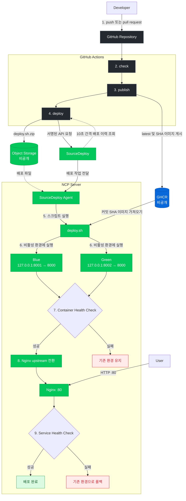
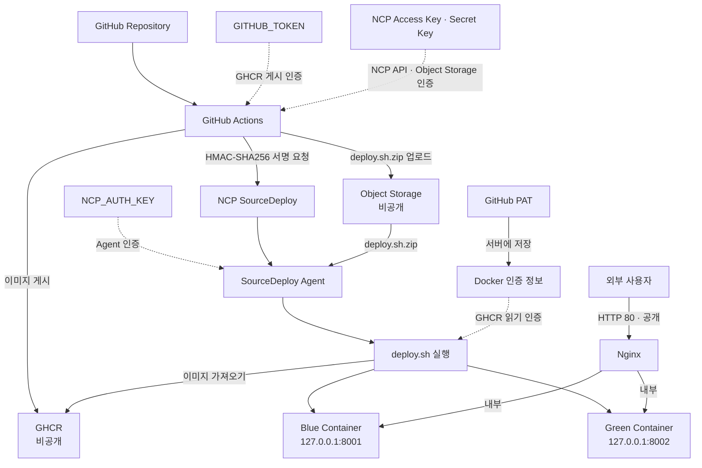
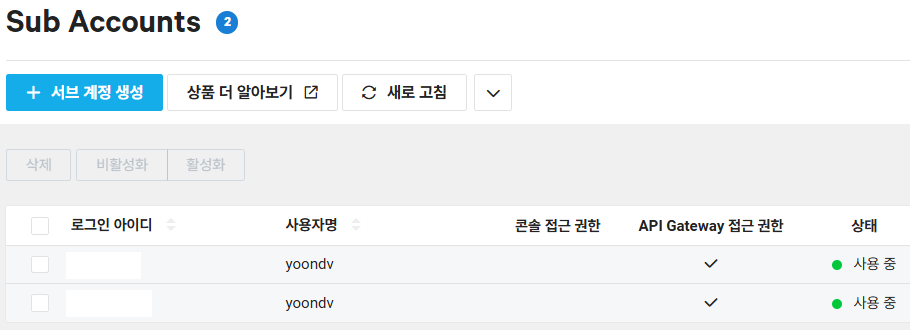
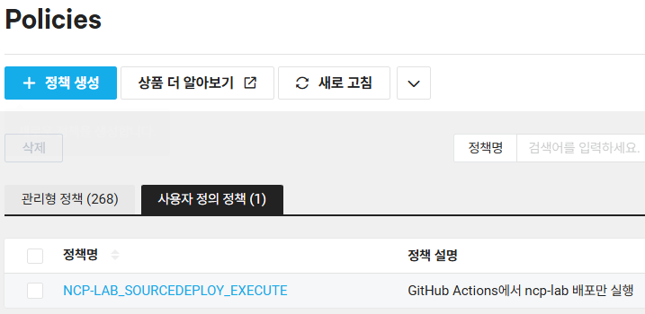
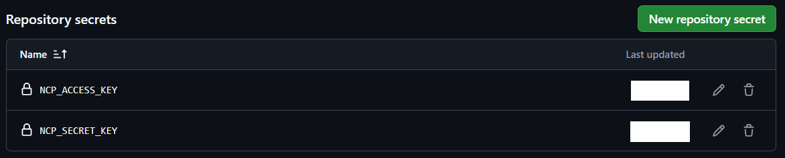
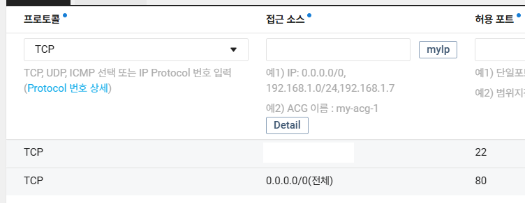
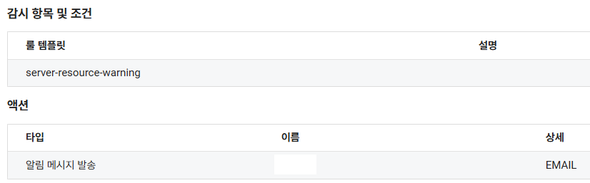

<h1 align="center">NCP CI/CD Lab</h1>

  GitHub Actions, Docker, GHCR, NCP SourceDeploy를 연동한 FastAPI 웹 API 자동 배포 프로젝트

## ncp-lab v4

**배포 주소**: [http://211.233.214.70](http://211.233.214.70) 
**개발 기간**: 2026.09 
**배포 환경**: NCP Server (Ubuntu 24.04.1 LTS)

## 목차

1. [프로젝트 개요](#프로젝트-개요)
2. [기술 스택](#기술-스택)
3. [CI/CD 아키텍처 및 배포 흐름](#cicd-아키텍처-및-배포-흐름)
4. [설계 선택과 이유](#설계-선택과-이유)
5. [보안 및 권한 관리](#보안-및-권한-관리)

## 프로젝트 개요

#### 이 프로젝트는 CI/CD의 전체 흐름을 이해하고 직접 구축하기 위해 시작했습니다.

프로젝트의 핵심 기능은 다음과 같습니다.

1. **API 자동 테스트**: `push`와 `pull request`마다 `pytest`로 `/`와 `/health`의 상태 코드와 응답 내용을 검사합니다.

2. **이미지 빌드 및 저장**: 테스트를 통과한 `main` 브랜치의 Docker 이미지를 빌드해 `latest`와 Git 커밋 SHA 태그로 GHCR에 게시합니다.
3. **배포 요청 자동화**: GitHub Actions가 `deploy.sh`를 Object Storage에 업로드하고 서명된 NCP API 요청으로 SourceDeploy 시나리오를 실행합니다.
4. **Blue-Green 무중단 배포**: SourceDeploy Agent가 비활성 컨테이너에 현재 Git 커밋과 일치하는 이미지를 실행한 뒤 Nginx의 요청 대상을 전환합니다.
5. **헬스 체크 및 롤백**: 새 컨테이너와 Nginx 전환 후의 HTTP 응답을 검사합니다. 모두 성공하면 새 컨테이너로 배포를 완료하고, 실패하면 기존 컨테이너로 요청을 되돌립니다.

## 기술 스택

### Development

### Deployment

### Infrastructure

## CI/CD 아키텍처 및 배포 흐름

#### `check`

- `push` 또는 `pull request`가 발생하면 Python 3.14.7을 설정하고 테스트에 필요한 패키지를 설치합니다.
- pytest로 `/` 페이지의 상태와 표시 내용, `/health`의 상태 코드와 응답값을 검사합니다.

#### `publish`

- `GITHUB_TOKEN`으로 GHCR에 로그인합니다.
- 저장소의 `Dockerfile`로 이미지를 빌드하고 `latest`와 전체 Git 커밋 SHA를 태그로 지정해 GHCR에 게시합니다.

#### `deploy`

- GitHub Secrets에 저장된 NCP 인증 키로 HMAC-SHA256 방식의 API 요청 서명을 생성합니다.
- SourceDeploy의 프로젝트, 스테이지, 시나리오 ID를 조회한 뒤 배포 API를 호출합니다.
- 배포 상태가 `success`이면 워크플로를 완료하고, 실패, 취소, 거절, 오류 또는 시간 초과 상태이면 워크플로를 실패 처리합니다.

#### `deploy.sh`

- 현재 Nginx 설정을 확인해 Blue와 Green 중 비활성 환경을 선택합니다.
- GHCR에서 현재 배포 커밋과 일치하는 이미지를 가져오고 비활성 컨테이너를 제거한 뒤 새 컨테이너를 생성합니다.
- 이후 검사에 성공하면 새 환경으로 배포를 완료하고, 기존 컨테이너는 다음 배포 또는 롤백을 위한 대기 상태로 유지합니다.

## 설계 선택과 이유

### GHCR 기반 이미지 배포

소스 코드와 빌드된 Docker 이미지를 GitHub 생태계 안에서 함께 관리하기 위해 Docker Hub와 같은 별도 레지스트리 대신 GitHub에서 제공하는 GHCR을 선택했습니다. GitHub Actions는 기본으로 제공되는 `GITHUB_TOKEN`으로 이미지를 게시하고, NCP 서버는 GitHub PAT로 비공개 이미지를 가져오도록 인증 수단을 분리했습니다.

### SSH 대신 SourceDeploy 사용

SSH 배포를 적용하면 서버의 22번 포트에 대한 접근 범위를 넓혀야 할 수도 있습니다. 이를 피하기 위해 GitHub Actions가 NCP API로 배포를 요청하고 서버 내부의 SourceDeploy Agent가 명령을 실행하는 방식을 선택했습니다.

### 이중 헬스 체크

첫 번째 헬스 체크는 새 컨테이너 내부의 `/health`를 호출해 FastAPI 서버가 정상적으로 시작됐는지 확인합니다. 
두 번째 헬스 체크는 Nginx 전환 후 실제 서비스 경로를 호출합니다. 이를 통해 컨테이너뿐만 아니라 Nginx 설정과 연결까지 정상인지 확인합니다.

## 보안 및 권한 관리

### 인증 및 접근 구조

### 계정 분리

   
  GitHub Actions용 Sub Account와 SourceDeploy Agent용 Sub Account를 분리해 하나의 인증 키가 다른 배포 구성에 미치는 영향을 줄였습니다.

### 최소 권한 정책

   
  Actions용 계정에는 지정된 SourceDeploy 프로젝트의 배포 실행 권한과 Object Storage 파일 업로드 권한만 사용자 정의 정책으로 부여했습니다. 
  NCP 서버에서 이미지를 가져오기 위한 GitHub PAT에는 <code>read:packages</code> 권한만 부여해 토큰의 작업 범위를 이미지 읽기로 제한했습니다.

### 인증 정보 관리

   
  NCP Access Key와 Secret Key는 하드 코딩하지 않고 GitHub Actions Secrets에 저장했습니다. 
  NCP 서버에 저장된 인증 정보는 <code>root</code> 계정만 접근할 수 있도록 파일 권한을 제한했습니다.

### 네트워크 접근 제한

   
  웹 서비스용 80번 포트는 Nginx를 통해 외부 접속을 허용하고, SSH 22번 포트는 관리자 공인 IP에서만 접근할 수 있도록 NCP ACG를 설정했습니다. 
  

### 서버 모니터링 및 알림

   
  서버의 CPU, 메모리, 파일 시스템 사용률을 감시하고 임계값을 초과하면 이메일 알림을 받도록 설정했습니다.

  <strong>감사합니다.</strong>

